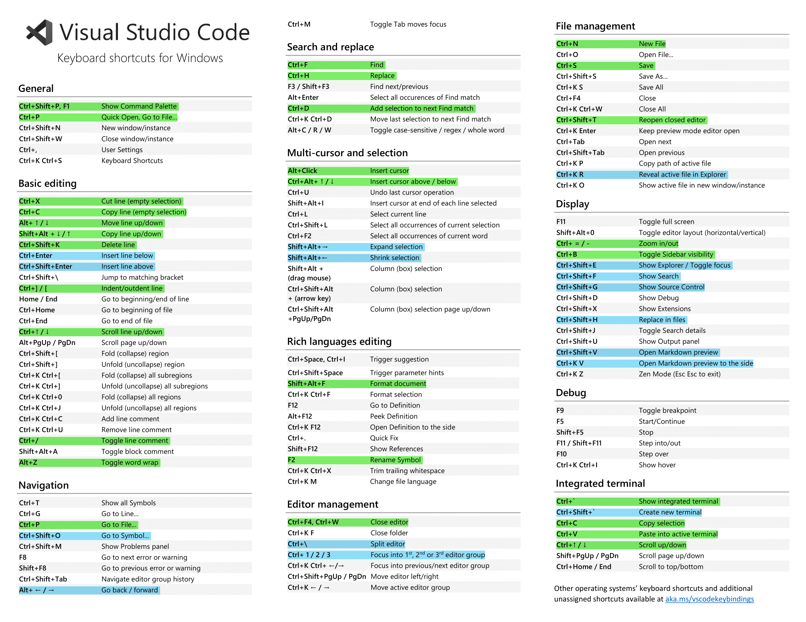

# Горячие клавиши VS Code

Горячие клавиши можно посмотреть и настроить в разделе `Kyeboard Shortcuts`. Открыть его можно сочетанием клавиш `ctrl + k ctrl + s`, либо через панель команд - `F1` или `ctrl + shift + p` и ввести `Keyboard Shortcuts`.

****

/// caption
Зелёным отмечены самые часто используемые комбинации, синим - более редкие, но тоже полезные. [PDF](attachments/vscode-keyboard-shortcuts.pdf){ target="_blank"}. [Source](https://code.visualstudio.com/shortcuts/keyboard-shortcuts-windows.pdf){ target="_blank"}.
///

!!! tip

    `ctrl + shift + p` - главное сочетание клавиш, которое стоит запомнить.

    `alt + 1/2/3/...` - переключение между открытыми вкладками в порядке их расположения.

    Удалить множественные курсоры можно с помощью `Esc`.

    Если с помощью `ctrl + d` выделили лишнее, то сочетанием `ctrl + u` можно убрать последнее выделение.

    `ctrl + alt + ←/→` - перенести файл в левую/правую группу вкладок.

    `alt + z` - крайне полезно при работе с Latex, Markdown и другими "широкими" файлами.

    `ctrl + j` - скрыть/показать нижнюю панель (терминал, логи и т.д.).

    `alt + shift + r` - показать файл, выбранный в левой панели с файлами, в проводнике.